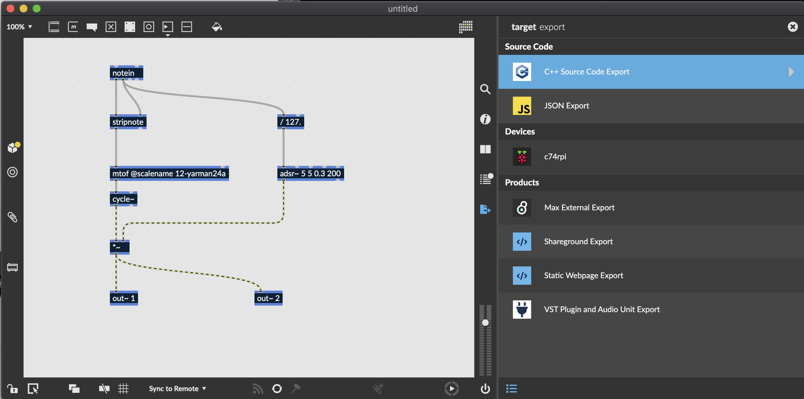

# STRING VST

This plugin will explore various ideas relating to controlling the physical properties of a "string" as a synth parameter. The goal is to eventually model fantastical sounding strings such as suspension bridge cables playing within a resonantor that produces some audible frequency.   

To start out, this instrument is based off of a max patch using waveguide synthesis to simulate the properties of a traveling wave as documented here: https://ccrma.stanford.edu/~jos/pasp/Digital_Waveguide_Models.html. The patch is mostly a copy of the patch demonstrated in this video: https://www.youtube.com/watch?v=Cc1-Rq0nSVo. 


## Prerequisites

- Download and install [CMake](https://cmake.org/download/). Version 3.18 or higher is required. On MacOS, we recommend installing CMake with [Homebrew](https://brew.sh/)
- Download and install [git](https://git-scm.com/downloads).
- Some kind of build system and compiler. You have options here.
 - (MacOS) Install Xcode command line tools by running `sudo xcode-select --install` on the command line. You'll use `make` to compile your application. (You will not be able to use Xcode to build your application unless you install Xcode itself.)
 - (MacOS/Linux/Unix-like) Install [Ninja](https://github.com/ninja-build/ninja/releases), easiest way is probably `brew install ninja` or `sudo apt-get install ninja`
 - (MacOS) Download and install [Xcode](https://developer.apple.com/xcode/resources/). We have tested using Xcode 12.
 - (Windows) Download and install [Visual Studio 2019](https://visualstudio.microsoft.com/vs/). Community Edition is enough!
 - (Linux/Unix-like) use `make`, often already on your system. For debian based systems `sudo apt-get install build-essential`

## File structure

The source code of the application is in the `src/` directory. This directory should contain everything that you need to modify to build your application.

Some notable files/directories:

| Location                          | Explanation   |
| --------------------------------- | ------------- |
| export/                           | The directory into which you should export your RNBO code |
| src/                              | Source for the project - feel free to edit (includes sample UI) |
| build/RNBOApp_artefacts/          | Your built application will end up here |
| build/RNBOAudioPlugin_artefacts/  | Your built plugins will end up here |

## Using this Template

This Github repo is a template, which means you can use it to start your own git-based project using this repository as a starting point. The major difference between a template and a fork is that your new project won't include the commit history of this template--it will be an entirely new starting point. For more see [the official description](https://docs.github.com/en/repositories/creating-and-managing-repositories/creating-a-repository-from-a-template).

### Working with RNBO and Building Your Project

Next, open the RNBO patcher you'd like to work with, and navigate to the export sidebar. Find "C++ Source Code Export" target.



Export your project, making sure to export into the `export` folder in this directory. Your export directory should look something like this:

```
export/
├─ rnbo/
├─ rnbo_source.cpp
├─ README.md
```

Whenever you make a change to your RNBO patch, remember to export the source code again to update this file. Now that you've exported your RNBO code, it's time to build. This project uses CMake, which gives us the flexibility of using whatever build system we want. Start by moving to the build directory.

```sh
cd build
```

Now you have a choice of what build system you want to use. Any one of the following will work:

- `cmake .. -G Xcode` (create an Xcode project)
- `cmake .. -G "Visual Studio 16"` (create a Visual Studio 2019 project)
- `cmake .. -G Ninja` (use Ninja to build)
- `cmake ..` (just use the default, which will be `make` on MacOS, Linux and other Unix-like platforms)

You might be wondering which on is "best". We say, if you're familiar with Xcode or Visual Studio or Ninja, just go with that. This might be a good time to get a snack, as CMake can take a few minutes to get everything ready, especially when generating the build files for the first time. You may also see a number of warnings in the console, which you can (probably) safely ignore.

Once CMake has finished generating your build system, you can finally build your project.

```
cmake --build .
```

Invoking `cmake` with the `--build` flag tells CMake to build your target, using whatever build tool you chose in the last step. After the build completes, you'll find the executable result in `build/RNBOApp_artefacts/Debug`, and you'll find plugins in `build/RNBOAudioPlugin_artefacts/Debug`.

If you're using the Xcode generator, but you don't have Xcode installed, you might see something like this when you try to build
```sh
% cmake --build .
xcode-select: error: tool 'xcodebuild' requires Xcode, but active developer directory '/Library/Developer/CommandLineTools' is a command line tools instance
```

This simply means that you need to install Xcode, and not just the command line tools.

## Additional Notes and Troubleshooting

### Building Plugins on M1 Macs
When building for M1 Macs, you will want to enable universal builds, so that your target can be used on both Intel and M1 macs. `CMakeLists.txt` has a line you can uncomment to enable universal builds.

### Help! My DAW Won't Load My Plugin
After building your plugin, you may find that it loads in some DAWs but not others. On MacOS, the problem is sometimes code signing. JUCE may incorrectly code sign your VST3 bundle. If you use the `codesign` tool to verify your VST3 bundle

```
codesign --verify --verbose RNBOAudioPlugin_artefacts/Release/VST3/MyPlugin.vst3
```

and you see an error like this:

```
RNBOAudioPlugin_artefacts/Release/VST3/MyPlugin.vst3: code has no resources but signature indicates they must be present
```

you're seeing the issue. Fortunately, you can give the plugin a new, ad-hoc code signature with the following command

```
codesign --force --deep -s - RNBOAudioPlugin_artefacts/Release/VST3/MyPlugin.vst3
```

You'll see a message like:

```
RNBOAudioPlugin_artefacts/Release/VST3/MyPlugin.vst3: replacing existing signature
```

Hopefully, this will resolve the issue.

### MIDI CC and VST3
VST3 introduced some changes to the way plugins handle MIDI data. One way to make newer VST3 plugins behave more like VST2 is to create Parameters for each MIDI CC value on each MIDI channel. You can dip your toes into the [full discussion](https://forums.steinberg.net/t/vst3-and-midi-cc-pitfall/201879/11) if you want, but we disable this behavior by default. If you really want it, you can enable it by commenting out the appropriate line in `CMakeLists.txt`.

